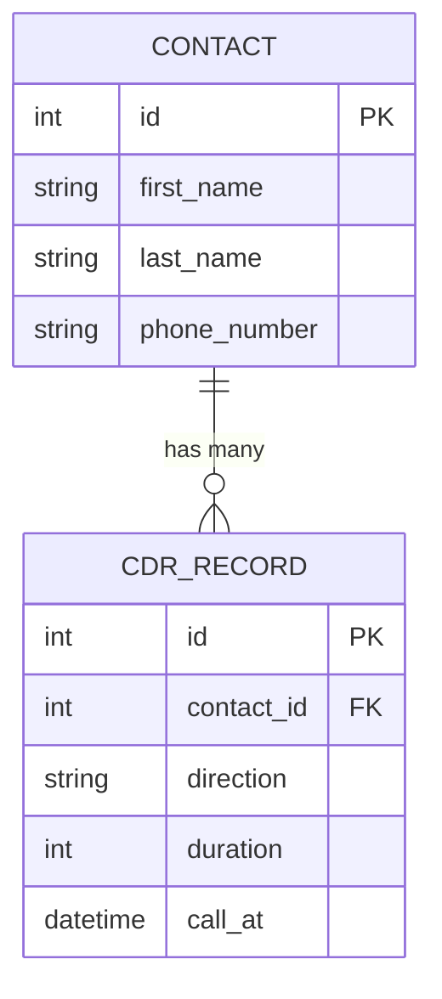
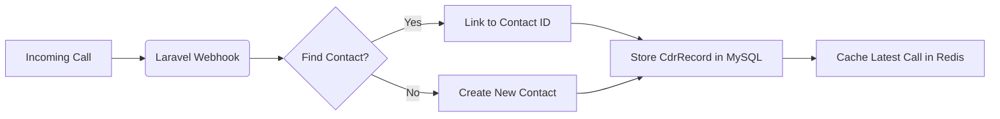

# Grandstream Phone Log Tool
  *A client uses a Grandstream phone system which does not come with a robust logging tool on its own. So we made one!*
## 🛠️ Tech Stack

| Tool | Category | Primary Purpose |
| :--- | :--- | :--- |
| **Laravel** | Framework | PHP web framework for elegant, full-stack development. |
| **MySQL** | Data Store | In-memory data structure store used for caching and queues. |
| **Laragon** | Environment | Local development server for managing PHP, Apache/Nginx, and MySQL. |

# Usage 

# Relationships

# Logic Flow

