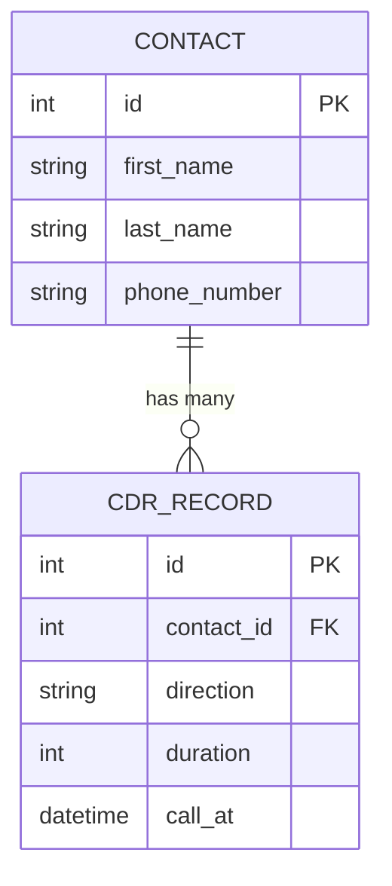
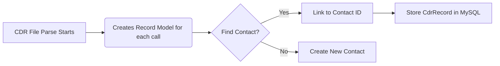

[App Tests](tests/Feature)

# Grandstream Phone Log Tool
  *A client uses a Grandstream phone system which does not come with a robust logging tool on its own. So we made one!*
  
## Built with ❤️ Stacked With

| Tool | Category | Primary Purpose |
| :--- | :--- | :--- |
| **Laravel** | Framework | PHP web framework for elegant, full-stack development. |
| **MySQL** | Data Store | In-memory data structure store used for caching and queues. |
| **Laragon** | Environment | Local development server for managing PHP, Apache/Nginx, and MySQL. |


# Relationships



# Logic Flow


# Usage
```bash
# clone the repo
git clone https://github.com/greg0rys/PhoneLog

```
### Commands
```bash
php artisan parser:parse
```
| Command | Schedule | Primary Purpose |
| :--- | :--- | :--- |
| **parser:parse** | Daily @ 04:00am | Parses the CSV file inside of /storage/public/records. |
| **MySQL** | Data Store | In-memory data structure store used for caching and queues. |
| **Laragon** | Environment | Local development server for managing PHP, Apache/Nginx, and MySQL. |


